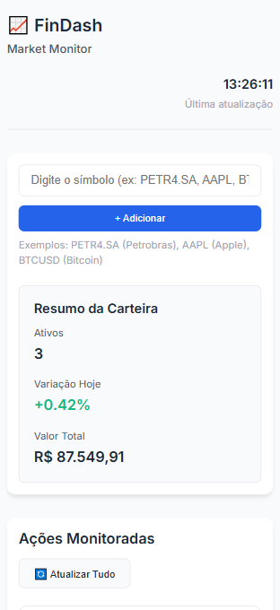

# 📈 FinDash Market Monitor

<p align="center">
  
  
  
  
  
</p>

<p align="center">
  <a href="#sobre">Sobre</a> •
  <a href="#funcionalidades">Funcionalidades</a> •
  <a href="#tecnologias">Tecnologias</a> •
  <a href="#como-executar">Como Executar</a> •
  <a href="#como-usar">Como Usar</a> •
  <a href="#estrutura-do-projeto">Estrutura</a> •
  <a href="#api">API</a> •
  <a href="#autor">Autor</a> •
  <a href="#licença">Licença</a>
</p>

<p align="center">
  <strong>Dashboard completo para monitoramento de ativos financeiros em tempo real.</strong>
</p>

<p align="center">
  <a href="https://rafaelamaral-dev.github.io/findash-marketmonitor/">🌐 Acessar Deploy</a> |
  <a href="https://github.com/rafaelamaral-dev/findash-marketmonitor">📦 Repositório</a>
</p>

---

## 📋 Sobre

O **FinDash Market Monitor** é uma aplicação web desenvolvida para fornecer uma visão consolidada e em tempo real do mercado financeiro. Ideal para investidores e entusiastas, ele agrega dados de ações, criptomoedas e índices em um dashboard intuitivo e responsivo.

Com uma interface moderna e limpa, o projeto permite o monitoramento personalizado de uma carteira de ativos, exibindo preços, variações, volumes e tendências gráficas. A aplicação consome dados da **Alpha Vantage API**, uma das principais fontes de dados financeiros gratuitos.

**Principais objetivos:**
- Fornecer visualização clara e acessível de dados de mercado
- Permitir criação de carteiras personalizadas de ativos
- Exibir tendências através de gráficos interativos
- Funcionar completamente no cliente (frontend apenas)

---

## ✨ Funcionalidades

### 📊 Monitoramento em Tempo Real
- **Busca e adição de ativos**: Adicione ações, criptomoedas e outros símbolos (ex: `PETR4.SA`, `AAPL`, `BTCUSD`)
- **Atualização dinâmica**: Dados atualizáveis manualmente ou através do botão "Atualizar Tudo"
- **Carteira personalizável**: Monitore apenas os ativos do seu interesse

### 🖼️ Visualização

| Seção Hero (Desktop) | Navegação Mobile |
| :---: | :---: |
|  |  |

### 📈 Visualização de Dados
- **Cards informativos**: Exibição de preço atual, variação percentual, preço de abertura, máxima, mínima e volume
- **Gráficos interativos**: Visualização de tendências usando Chart.js
- **Indicadores visuais**: Cores e ícones que indicam performance (positiva/negativa/neutra)
- **Resumo da carteira**: Visão consolidada do desempenho geral

### 🎨 Interface Intuitiva
- **Design responsivo**: Adaptável a diferentes tamanhos de tela
- **Feedback visual imediato**: Animações e estados interativos
- **Organização clara**: Layout que separa controles, dados e resumo
- **Paleta de cores profissional**: Esquema de cores voltado para dados financeiros

### ⚙️ Controles e Personalização
- **Adição/remoção de ativos**: Controle completo sobre sua lista monitorada
- **Atualizações individuais ou em massa**: Atualize um ativo específico ou todos de uma vez
- **Armazenamento local**: Sua carteira é salva no navegador entre sessões
- **Timestamps**: Visualização do momento da última atualização

---

## 🛠️ Tecnologias

| Tecnologia | Função | Versão/Detalhe |
|------------|---------|----------------|
| **HTML5** | Estrutura semântica da aplicação | Últimas especificações |
| **CSS3** | Estilização e layout responsivo | Flexbox, Grid, Variáveis CSS |
| **JavaScript (ES6+)** | Lógica da aplicação e manipulação de DOM | Módulos, Async/Await, LocalStorage |
| **Chart.js** | Gráficos interativos para visualização de dados | v4.x |
| **Alpha Vantage API** | Fonte de dados financeiros em tempo real | Plano Free (5 chamadas/minuto) |
| **Google Fonts** | Tipografia moderna (Inter) | Família Inter |
| **GitHub Pages** | Hospedagem e deploy contínuo | Automático do repositório |

---

## 🚀 Como Executar

### Pré-requisitos
- Navegador web moderno (Chrome 90+, Firefox 88+, Safari 14+)
- Conexão com internet (para acesso à API)
- Conta no Alpha Vantage (opcional, para chave própria)

### Método 1: Acesso Online (Recomendado)
1. Acesse o deploy oficial: [https://rafaelamaral-dev.github.io/findash-marketmonitor/](https://rafaelamaral-dev.github.io/findash-marketmonitor/)
2. Comece a usar imediatamente!

### Método 2: Execução Local
```bash
# 1. Clone o repositório
git clone https://github.com/rafaelamaral-dev/findash-marketmonitor.git

# 2. Acesse o diretório do projeto
cd findash-marketmonitor

# 3. Abra o arquivo principal no navegador
# Método simples: clique duplo em index.html
# Ou use um servidor local:

# Com Python
python -m http.server 8000

# Com Node.js (se tiver o pacote 'serve' instalado)
npx serve
```

### Método 3: Com API Key Própria (Opcional)
Por padrão, a aplicação usa uma chave de API demo. Para usar sua própria chave:

1. Crie uma conta gratuita em [Alpha Vantage](https://www.alphavantage.co/support/#api-key)
2. Obtenha sua chave API
3. No arquivo `script.js`, substitua a constante `API_KEY` pela sua chave:
```javascript
const API_KEY = 'SUA_CHAVE_AQUI'; // Substitua pela sua chave
```

---

## 📖 Como Usar

### Adicionando um Ativo
1. No campo de busca, digite o símbolo do ativo (ex: `PETR4.SA` para Petrobras)
2. Clique em "+ Adicionar" ou pressione Enter
3. O card do ativo será criado automaticamente com os dados mais recentes

### Símbolos Exemplos
| Tipo | Símbolo | Descrição |
|------|---------|-----------|
| **Ações Brasileiras** | `PETR4.SA`, `VALE3.SA`, `ITUB4.SA` | Ações da B3 (sufixo .SA obrigatório) |
| **Ações Americanas** | `AAPL`, `TSLA`, `GOOGL` | Ações da NASDAQ/NYSE |
| **Criptomoedas** | `BTCUSD`, `ETHUSD` | Par de criptomoedas em dólar |
| **Índices** | `^BVSP`, `^GSPC` | Índices Bovespa e S&P 500 |

### Interagindo com os Cards
- **Atualizar individualmente**: Clique no botão "Atualizar" no rodapé do card
- **Remover ativo**: Clique no "×" no canto superior direito do card
- **Atualizar todos**: Use o botão "🔄 Atualizar Tudo" no cabeçalho do dashboard
- **Visualizar gráfico**: Cada card exibe um gráfico de linha com a variação do preço

### Resumo da Carteira
O painel de resumo mostra:
- **Total de ativos**: Quantidade de símbolos sendo monitorados
- **Variação hoje**: Média ponderada das variações percentuais
- **Valor total**: Soma dos valores dos ativos (em reais)

---

## 📁 Estrutura do Projeto

```
findash-marketmonitor/
│
├── index.html              # Estrutura principal da aplicação
├── styles.css              # Estilos e layout responsivo
├── script.js               # Lógica principal e integração com API
│
├── README.md               # Este arquivo
└── (assets/)               # Pasta para imagens, ícones, etc (opcional)
```

### Arquivos Principais

| Arquivo | Descrição |
|---------|-----------|
| **index.html** | Estrutura HTML5 semântica com template para cards |
| **styles.css** | Estilização completa com design system próprio |
| **script.js** | Toda a lógica de: API, manipulação DOM, gráficos, localStorage |

### Fluxo da Aplicação
1. **Carregamento**: Inicializa a interface e recupera carteira salva
2. **Interação**: Usuário adiciona/remove ativos
3. **Requisição**: Aplicação busca dados na Alpha Vantage API
4. **Processamento**: Dados são formatados e exibidos
5. **Persistência**: Carteira é salva no localStorage do navegador

---

## 🔌 API

### Alpha Vantage
A aplicação utiliza a [Alpha Vantage API](https://www.alphavantage.co/) para obter dados financeiros em tempo real.

**Endpoint utilizado:** `https://www.alphavantage.co/query`
- **Função**: `GLOBAL_QUOTE` - Dados intradiários
- **Função**: `TIME_SERIES_DAILY` - Dados históricos para gráficos

**Limitações (plano free):**
- 5 requisições por minuto
- 500 requisições por dia
- Dados com delay de até 15 minutos para ações

### Tratamento de Erros
A aplicação inclui tratamento robusto para:
- Limite de requisições excedido
- Símbolos inválidos ou não encontrados
- Falhas de conexão com a API
- Dados incompletos ou mal formatados

---

## 👨‍💻 Autor

**Rafael Fróz do Amaral**

- GitHub: [@rafaelamaral-dev](https://github.com/rafaelamaral-dev)
- Projeto: [FinDash Market Monitor](https://github.com/rafaelamaral-dev/findash-marketmonitor)
- Deploy: [Acessar Aplicação](https://rafaelamaral-dev.github.io/findash-marketmonitor/)

Este projeto foi desenvolvido como parte de um portfólio de desenvolvimento front-end, demonstrando habilidades em:
- Consumo de APIs RESTful
- Manipulação assíncrona de dados
- Criação de interfaces responsivas e acessíveis
- Implementação de gráficos e visualização de dados
- Gestão de estado no cliente (localStorage)

---

## 📄 Licença

Este projeto está licenciado sob a **MIT License** - veja o arquivo [LICENSE](LICENSE) para detalhes.

```
MIT License

Copyright (c) 2025 Rafael Fróz do Amaral

Permissão é concedida, gratuitamente, a qualquer pessoa que obtenha uma cópia
deste software e arquivos de documentação associados (o "Software"), para lidar
no Software sem restrição, incluindo sem limitação os direitos de usar, copiar,
modificar, fundir, publicar, distribuir, sublicenciar e/ou vender cópias do Software...
```

**Isenção de responsabilidade:** Este é um projeto demonstrativo para fins educacionais. Os dados financeiros podem ter atraso e não devem ser usados para tomada de decisões de investimento real. Sempre consulte fontes oficiais e profissionais qualificados para decisões financeiras.

---

<p align="center">
  Feito com ❤️ por <a href="https://github.com/rafaelamaral-dev">Rafael Amaral</a>
</p>
